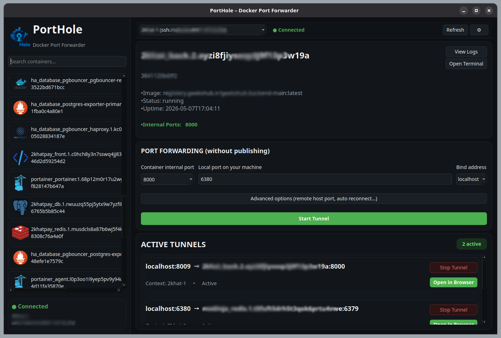

# PortHole – Docker Internal Port Forwarder

**A lightweight, open-source alternative to Lens for forwarding unpublished Docker container ports to your local machine.**
> No need to publish ports on the remote Docker host - uses a `socat` proxy + SSH tunnel under the hood.

   [](https://opensource.org/licenses/MIT)


## ➬ Features

- 💮 **Forward unpublished ports** – target container ports stay closed on the remote host.
- 🣰 **Works with any Docker context** (local, remote over SSH, etc.) – seamlessly switch between environments.
- 🔴 **Simple GUI** built with PyQt6 – select context, container, internal port, and local port.
- 🚠 **One”click start/stop** – automatically creates a `socat` proxy on the remote host and sets up an SSH tunnel.
- 👄 **Real”time container logs** – view and follow container output.
- 🔪 **Interactive terminal** – open a shell inside any container.
- 🦹 **Automatic cleanup** – removes the proxy container and closes the SSH tunnel when you stop forwarding.
- 🤧 **No manual `ssh -L` or `docker run -p`* – everything is automated.

## 🎳 Why not just use `docker run -p` or Lens?

| Feature                         | Docker `-p` (publish) | Lens (paid) | PortHole |
|--------------------------------|-----------------------|-------------|----------|
| Access container without publishing port | ❌                   | ✅ (limited) | ✅       |
| Works with any Docker context  | ✅                     | ✅           | ✅       |
| GUI for quick forwarding       | ❌                     | ✅           | ✅       |
| Open source & free             | ✅                     | ❌           | ✅       |
| No agent required on remote host | ✅                   | ❌ (needs Lens agent) | ✅ |

**PortHole fills the gap**: you get the simplicity of Lens for port forwarding, but completely open source and without publishing any ports on the remote Docker host.

## 📦 Requirements

- **Local machine**: Python 3.9+, `pip`, SSH client (OpenSSH), Docker CLI (for context management)
- **Remote server**: Docker daemon, `ssh` access for the current user, ability to run `alpine/socat` containers
- **Both sides**: the same SSH user must be able to run `docker` commands (user must be in the `docker` group on the remote server)

## 🛠️ Setup

### 1. Install dependencies on your local machine

```bash
sudo apt install python3-virtualenv
```

### 2. (Important) Add your user to the `docker` group on **both local and remote machines**

The Docker daemon uses a Unix socket ( `/var/run/docker.sock`) that is only accessible by the `root` user or members of the `docker` group. You need to add your user to that group on **each machine** where your Python script will run Docker commands (for local, it’s your own PC; for remote, it’s the server that hosts the containers).

**On the local machine (your PC)**

```bash
sudo usermod -aG docker $USER
```
Then log out and back in (or `newgrp docker`) for the changes to take effect.

**On the remote server (the one you connect to via SSH)**

```bash
ssh user@remote-host
sudo usermod -aG docker $USER
exit
```
After this, reconnect and verify with:

```bash
ssh user@remote-host "docker ps"
```
If it works without `sudo`, you are ready.

#### ⚠️ Security note: Adding a user to the docker group gives them effective root access on the Docker host. Only do this for trusted users.

### 3. Create a Docker context that uses SSH (if you don’t already have one)

```bash
docker context create --docker "host=ssh://username@remote-host"
```
Test the context:
```bash
docker context ls
```

### 4. Clone the repository

```bash
git clone https://github.com/mohammaddan/port-hole.git
cd port-hole
```

### 5. Run the application

```bash
virtualenv venv
source ./venv/bin/activate
pip install -r requirements.txt
python main.py
```

## 🚀 How to use



1. **Select Docker context** from the dropdown (all contexts shown via `docker context ls`).
2. **Choose a running container** – the list updates automatically (type to search).
3. **Enter the container’s internal port** (e.g., `6379` for Redis).
4. **Enter a free local port** (e.g., `6380`).
5. *(Optional)* **Specify a fixed remote host port** for the `socat` proxy – specify arandom (if left empty) our a fixed value.
6. Click **"Start Port Forward"**.
7. Once successful, connect to your service from localhost:

   ```bash
   redis-cli -h 127.0.0.1 -p 6380
   ```

8. Stop forwarding by clicking **"Stop"** next to the active forward in the list.

### Viewing logs
- Select a container from the list.
- Click **"View Logs"**. A text box for the container's logs will appear, showing the last 100 lines.
- Check **"Follow (live)"** to stream new logs in real time.

### Opening a terminal in a container
- Select a container.
- Click **"Open Terminal"**. A new terminal window (e.g., `gnome-terminal`, `konsole`, or `xterm`) will open with a shell inside the container.

## 🧩 How e funksich es (architecture)

```text
[Your local machine]                      [Remote Docker Host]
        │                                          │
        │  1. SSH tunnel (paramiko)                │
        ├──────────────────────────────────────────┤
        │                                          │
        │  2. Docker client (over same SSH) creates│
        │     a socat container on the host        │
        │                                          │
        │                     ┌────────────────────┼──────────────────┐
        │                     │  socat container   │                  │
        │                     │  listens on port   │                  │
        │                     │  (e.g. 16379)      │                  │
        │                     └────────┬───────────┘                  │
        │                              │                              │
        │                              │ forwards to                  │
        │                              ▼                              │
        │                     ┌────────────────────┐                  │
        │                     │  Target container  │                  │
        │                     │  (e.g. Redis)      │                  │
        │                     │  IP: 10.0.10.48    │                  │
        │                     │  internal port 6379│                  │
        │                     └────────────────────┘                  │
        │                                                             │
```

- The target container does **not** have any published ports ( `-p`).
- The `socat` proxy container is attached to the **same Docker network** as the target, so it can reach the target’s internal IP and port.
- The proxy publishes a **Host port** (on the remote host) - that port is the only one opened on the remote host.
- An **SSH tunnel** (local port forward) is created from your local machine to that published port.
- All traffic flows: `localhost:6380` → SSH tunnel → remote `localhost:16379` → socat → target `10.0.10.48:6379`.

## 🢅 Detailed Installation for Docker Group permission (linux/only)

To let your user run docker commands without sudo, you must be in the group `docker`.
```bash
sudo groupadd ${USER} docker
```
### 🔐 Security notes
- The SSH tunnel uses the credentials already set up for your Docker context (SSH agent or keys). No extra passwords are stored.

- The socat container runs with the minimal alpine/socat image and is automatically removed when forwarding stops.

- Only the local port on your machine is exposed; the remote Docker host still does not publish the target container’s port to the outside world.

### 🐞 Troubleshooting
| Problem | Likely solution |
|-------------------------|-------------------------------|
|Connection refused on local port | Check that the SSH tunnel is active – run netstat -tlnp \| grep <local_port> on your local machine. Make sure the remote host’s firewall allows outgoing connections from the socat container.|
|socat container fails to start|Ensure alpine/socat image is present on remote host (docker pull alpine/socat). Also verify that your remote user can run Docker commands without sudo.|
|SSH tunnel error: channel 3: open failed|The remote host may have AllowTcpForwarding no in /etc/ssh/sshd_config. Set it to yes and restart sshd.|
|Cannot select a network – container shows none|The container must be attached to a user‑defined bridge network. You can create one with docker network create mynet and attach the container.|
|docker command not found or permission denied|Your user is not in the docker group (see Setup step 2) or Docker is not installed.|
|Terminal does not open|Install a terminal emulator like xterm, gnome-terminal, or konsole. On Linux, xterm is almost always available.|

### 📚 Extending the tool
The code is designed to be modular. You can easily add:

- Service‑based forwarding (Docker Swarm / Kubernetes).
- Password or key‑file authentication for SSH.

### 🤝 Contributing
Pull requests are welcome! For major changes, please open an issue first to discuss what you would like to change.

### 📄 License
MIT

### 🙏 Acknowledgements
- docker-py
- paramiko
- PyQt6
- alpine/socat

## Stop publishing ports you don't need. Forward smartly. 🐳
